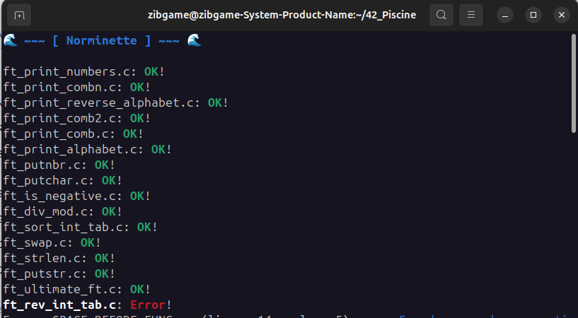

# Improve Norminette

**Improve Norminette** is a customized and enhanced version of the original Norminette tool used in 42 schools.  
It features a cleaner interface and some QoL (quality of life) improvements to make your experience smoother and more pleasant.

---

## 🔧 Installation Instructions

1. **First, install the official Norminette**  
   You can use either [`pipx`](https://pypa.github.io/pipx/) or a classic `pip` installation inside a Python `venv`.

2. **Locate the Norminette installation folder**  
   - For `pipx`, it's usually located at:  
     ```
     ~/.local/share/pipx/venvs/
     ```
   - For `pip` inside a `venv`, locate the corresponding virtual environment directory.

3. **Replace the Norminette folder with this improved version**  
   In the `venvs` directory, run:
   ```bash
   rm -rf norminette && git clone https://github.com/Zibgame/improve-norminette.git norminette
   ```

4. **📷 Interface preview**

   
